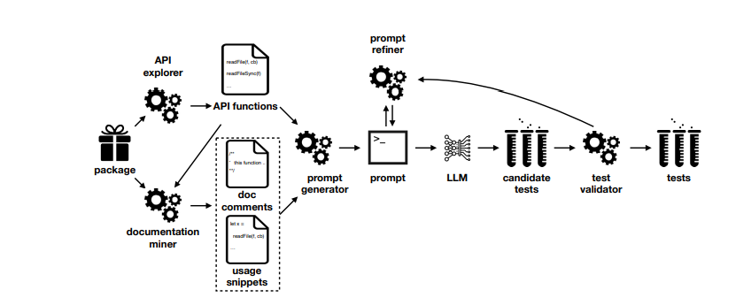

# AUTesting
AUTesting(Automatic Unit testing) is project for generating tests with rescue ChatGPT. The main purpose this project is helping c/c++ developer with unit testing written code.
# The base of this project is attempt to implement the article https://arxiv.org/abs/2302.06527
Requirements:
* openAI
* Key for ChatGPT
* Cmake
* Ninja
* python 3.11
# Struct of the main algorithm

# Getting started
* Configure API Key for ChatGPT(link for getting this key)
`https://help.openai.com/en/articles/5112595-best-practices-for-api-key-safety`
Linux / MacOS Set-up

Option 1: Set your ‘OPENAI_API_KEY’ Environment Variable using zsh

 

1. Run the following command in your terminal, replacing yourkey with your API key. 

echo "export OPENAI_API_KEY='yourkey'" >> ~/.zshrc
 

2. Update the shell with the new variable:

source ~/.zshrc
 

3. Confirm that you have set your environment variable using the following command. 

echo $OPENAI_API_KEY
The value of your API key will be the resulting output.

# Start
* mkdir build
* python3
* python3 main.py --source-file="./examples/RBTree/RBTree.c" --include-file="./examples/RBTree/RBTree.h" --compiler=gcc --model-gpt=gpt-4-1106-preview

# Current Status
We prepared demo release of this project. This implementation provide good results for coverage c-code. Model chat-gpt-4 give coverage for complex test RBTree is 67 percent. Current demo-version supports only one source file and one header. We would like fix in future releases with support Clang AST.
